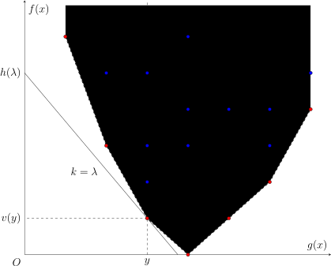

## 引入

本文介绍利用 WQS 二分优化动态规划问题的方法。在不同的文章中，它也常称作带权二分、凸优化 DP、凸完全单调性 DP、Lagrange 乘子法等，在国外也称作 Aliens Trick。它最早由王钦石在集训队论文《浅析一类二分方法》中总结。

可以用 WQS 二分解决的问题，通常都可以表述为带有数量限制的最优化问题，而且如果解除了这一限制，原问题就很容易解决。

比如，假设要解决的问题是，要从 $n$ 个物品中选取 $m$ 个，并最优化某个较复杂的目标函数。如果设从前 $i$ 个物品中选取 $j$ 个，目标函数的最优值为 $f(i,j)$，那么原问题的答案就是 $f(n,m)$。这类问题中，一个典型的状态转移方程通常是二维的。直接实现该状态转移方程，时间复杂度是 $O(nm)$ 的，难以接受。

进一步假设，没有数量限制的最优化问题容易解决。但是，选取到的最优数量未必满足原问题的限制。假设选取的物品过多。那么，就可以考虑在选取物品时，为每个选取到的物品都附加一个固定大小的惩罚 $k$（即「带权二分」中的「权」），仍然解没有数量限制的最优化问题。根据 $k$ 的取值不同，选取到的最优数量也会有所不同；而且，随着 $k$ 的变化，选取到的最优数量的变化也是单调的。所以，可以通过二分，找到 $k$ 使得选取到的最优数量恰为 $m$。此时，设目标函数的最优值为 $f_k(n)$，那么，只要消除额外附加的惩罚造成的价值损失，就能得到原问题的答案 $f(n,m)=f_k(n)+km$。复杂度也降低到了 $O(n\log L)$，其中，$O(\log L)$ 是二分 $\lambda$ 需要的次数。 

这就是 WQS 二分的基本想法。但是，这一想法能够行得通，前提是 $f(n,m)$ 关于 $m$ 是凸的。否则，可能不存在使得最优数量恰为 $m$ 的附加惩罚 $k$。这也是这种 DP 优化方法常常称为「凸优化 DP」或「凸完全单调性 DP」的原因。

## 基本方法

设非空集合 $X$ 为（有限的）决策空间，$f:X\rightarrow\mathbf R$ 为目标函数，且另有函数 $g:X\rightarrow\mathbf R^d$ 用于施加限制。考察最优化问题

$$
\begin{aligned}
v(y)=\min_{x\in X}\;&f(x)\\
\text{subject to }&g(x)=y.
\end{aligned}
$$

比如，对于前文提到的限制数量的问题，$X$ 可以理解为所有物品集合的子集族，$x\in X$ 是单个子集，$f(x)$ 是单个子集的价值函数，$g(x)$ 是子集 $x$ 中的元素个数。当然，$g(x)$ 并非只能是数量限制，后文提供了更为一般的限制的例子。

???+ info "约定"
    为了行文方便，本文仅讨论最小化目标函数的问题。最大化目标函数的问题与之相仿，只是需要将本文中的（下）凸函数相应地替换成凹函数（或称上凸函数）。或者，可以通过添加负号，将最大化目标函数的问题，转化为最小化它的相反数的问题。

### 几何直观

因为算法竞赛中遇到的大多数问题都是组合优化问题，决策空间 $X$ 通常没有良好的结构，所以，可以转而考察集合

$$
\mathcal D = \{(g(x),f(x))\in\mathbf R\times\mathbf R^d:x\in X\}.
$$

基本方法能够解决的主要是 $d=1$ 的情形，即只有一个限制的情形。下图提供了此时点集 $\mathcal D$ 的一种可能的图示。

图中的红点和蓝点是 $X$ 中所有可能的选择投影在平面 $(g(x),f(x))$ 上得到的集合 $\mathcal D$。于是，原问题所要求的就是横坐标为 $y$ 的那些点中，纵坐标的最小值 $v(y)$。当 $y$ 变动时，所有这样的点 $(y,v(y))$ 就构成了图中的红点的集合。

为了求得点 $(y,v(y))$ 的纵坐标，可以考虑用斜率为 $\lambda\in\mathbf R$ 的直线去切集合 $\mathcal D$。如图所示，当直线的斜率选取得恰当时，经过点 $(y,v(y))$ 的那条直线，是所有经过集合 $\mathcal D$ 中的点且斜率为 $\lambda$ 的直线中，截距 $f(x)-\lambda g(x)$ 最小的。记

$$
h(\lambda) = \min_{x\in X}f(x)-\lambda g(x)
$$

为这一最小值。那么，因为 $(y,v(y))$ 同样位于该直线上，就可以得到原问题的解

$$
v(y) = h(\lambda) + \lambda y.
$$

假设对于所有合理范围的 $\lambda$，上述函数 $h(\lambda)$ 都是容易求解的。这在算法竞赛中常常是成立的，因为它没有原问题中的限制条件。那么，现在面临的最为重要的两个问题，就是

1.  是否存在这样的直线斜率 $\lambda$，使得它的截距最小值恰好取得在点 $(y,v(y))$ 处，以及
2.  如果存在，如何找到这样的斜率 $\lambda$。

第一个问题相对容易解决。因为当直线斜率 $\lambda$ 发生变化时，所有这些直线切出的集合（即它们对应的上半平面的交）必然是一个凸集。因此，这些直线能够经过某个点，当且仅当这个点在该凸集的下凸壳上。这等价于说，函数 $v(y)$ 是 [凸函数](./slope-trick.md#离散点集上的凸函数)。

第二个问题则更为精细。因为已知所求点的横坐标为 $y$，所以，一个自然的思路是，计算 $h(\lambda)$ 时，顺便求出限制函数 $g(x)$ 在当前最优解 $x_\lambda$ 处的取值。比如，在前文提到的例子中，求解带惩罚的问题时，可以记录带惩罚的目标函数取得最优解时，选取的物品数量。然后，将 $g(x_\lambda)$ 与所期望的 $y$ 进行比较，并相应调整下次计算时的 $\lambda$ 的取值。这就是最为传统的 WQS 二分的方法。

总结一下，传统 WQS 二分的基本流程如下：

1.  初始时，选取一个 $\lambda$ 的合理的区间；
2.  在当前的区间中选择一个 $\lambda$；
3.  求解带惩罚的问题 $h(\lambda)=\min_{x\in X}f(x)-\lambda g(x)$，并记录它的最优解 $x_\lambda$ 处 $g(x)$ 的取值 $g(x_\lambda)$；
4.  如果 $g(x_\lambda)=y$，就得到原问题的最优价值 $v(y)=h(\lambda)+\lambda y$，直接结束算法；
5.  否则，根据 $g(x_\lambda)$ 与 $y$ 的大小关系，调整 $\lambda$ 的区间，并回到步骤 2。

这一基本流程已经足以解决一些问题，但并不完善。接下来，本文将讨论对这一基本流程的改进。

### 共线情形的处理

在应用基本流程时，首先遇到的问题就是共线情形无法正确处理。

如果点集 $\mathcal D$ 的下凸壳上有三个及以上的红点共线，那么在上述基本流程中，可能无法正确地判断 $g(x_\lambda)$ 与 $y$ 的大小关系。比如，设共线的三个红点的横坐标分别为 $y_1,y_2,y_3$，且它们共线的直线的斜率为 $\lambda^*$。那么，要正确求解 $v(y_2)$，就必须保证算法终止时，最后计算的问题是 $h(\lambda^*)$，因为 $\lambda^*$ 是唯一一个最小化截距时能够经过点 $(y_2,v(y_2))$ 的直线的斜率。但是，因为在求解 $h(\lambda^*)$ 的过程中，记录的 $g(x_{\lambda^*})$ 可能是 $y_1,y_2,y_3$ 中的任意一个。如果记录到的 $g(x_{\lambda^*})$ 不等于 $y_2$，那么算法将错误地继续运行，并向着背离 $y_2$ 的方向调整 $\lambda$ 的区间，最终将得到错误的结果。

为了解决共线的情形，一种处理方法是在记录最优解 $x_\lambda$ 对应的 $g(x_\lambda)$ 时，总是使之尽可能大（或尽可能小）。同时，将二分中的终止条件从寻找恰好满足 $g(x_\lambda)=y$ 的 $\lambda$ 改为寻找满足 $g(x_\lambda)\ge y$（或 $g(x_\lambda)\le y$）的最小（或最大）的 $\lambda$。在上一段的例子中，这相当于计算问题 $h(\lambda^*)$ 时，输出的 $g(x_{\lambda^*})$ 是 $y_3$。这就保证了算法终止时，最后计算的问题是 $h(\lambda^*)$。实现这一方法时，需要注意最后输出的不是 $h(\lambda)+\lambda g(x_{\lambda})$ 而是 $h(\lambda)+\lambda y$，因为记录的 $g(x_\lambda)$ 未必等于实际的限制 $y$。

另一种处理方法是实数二分。如果问题涉及的数字都是整数，显然，WQS 二分中的斜率也是整数。在二分中引入实数，是为了保证错误地排除正确选项 $\lambda^*$ 时，可以通过小数部分调整回来，最终逼近正确答案 $\lambda^*$。例如，在上面的例子中，如果计算问题 $h(\lambda^*)$ 时，记录的 $g(x_{\lambda^*})$ 是 $y_1$，小于所希望的 $y_2$，那么，算法就会转而考虑区间 $(\lambda^*,\lambda_r]$，其中，$\lambda_r$ 是 $\lambda$ 所在区间的右端点。对于整数的情形，这一区间实际应该写作 $[\lambda_*+1,\lambda_r]$，这就排除了在后续算法中接近正确答案 $\lambda^*$ 的可能。但是，实数二分时，考虑的区间仍然是 $(\lambda^*,\lambda_r]$，而且，对于该区间中的 $\lambda$，求解 $h(\lambda)$ 时记录的 $g(x_\lambda)$ 总是不小于 $y_3$，从而严格大于 $y_2$ 的。因此，随着算法继续进行，会不断地舍去右半区间，从而，最终得到的 $\lambda$ 的范围可以保证在 $\lambda^*$ 附近。当然，因为已知斜率总是整数，实数二分终止时的精度不必太高，只要能保证二分的区间中只包含一个整数即可，这一整数就是要寻找的 $\lambda^*$。

正确地处理共线情形后，WQS 二分足以解决绝大多数算法竞赛会遇到的 WQS 二分的问题。但是，这一方法仍然存在一些不足之处：它无法处理 $g(x_\lambda)$ 难以记录的情形，也无法处理高维 WQS 二分中多个点共面的情形。本文将进一步考察最优化问题 $v(y)$ 的性质，并提出更为一般的处理方法。

## 通用方法

本节介绍一种 WQS 二分的实现方法，它只要求对于所有 $\lambda\in\mathbf R^d$，可以高效地计算

$$
h(\lambda) = \min_{x\in X}f(x)-\lambda\cdot g(x)
$$

的取值，且原问题的最优值 $v(y)$ 是关于 $y\in\mathbf R^d$ 的凸函数[^high-d-convex]。用一句话概括，本节将证明原问题的解 $v(y)$ 就等于它的对偶问题的解

$$
v^\star(y) = \sup_{\lambda\in\mathbf R^d} h(\lambda)+\lambda\cdot y,
$$

而对偶问题的目标函数是关于 $\lambda\in\mathbf R^d$ 的凹函数，从而是单峰函数，可以通过 [三分法](../../basic/binary.md#三分法) 或 [黄金分割法](../../basic/binary.md#优化黄金分割法) 高效地求解，复杂度仍然是 $O(n\log L)$ 的。这就完全地解决了传统 WQS 二分方法中记录 $g(x_\lambda)$ 的值可能会出现的问题，同时，允许将 WQS 二分的思想应用至高维的情形。

另外，本节还说明，$g(x_\lambda)$ 的范围可以通过 $h(\lambda)$ 求得，而无需在求解 $h(\lambda)$ 时额外记录。例如，对于 $d=1$ 且问题只涉及整数的情形，可以证明 $g(x_\lambda)$ 的取值范围恰为

$$
[h(\lambda-1)-h(\lambda),h(\lambda)-h(\lambda+1)].
$$

这实际上也对于不得不采取前文所述二分流程的题目，提供了又一种解决共线问题的方法。

接下来，本节将用凸分析的理论证明这些结论成立。至于这些方法的具体应用，可以参考 [例题](#例题) 一节。

### Lagrange 对偶

考虑用 [Lagrange 乘子法](https://en.wikipedia.org/wiki/Lagrange_multiplier) 解决该问题。引入 Lagrange 乘子 $\lambda\in\mathbf R^d$，那么，Lagrangian 可以写作

$$
L(x,\lambda,y) = f(x) - \lambda\cdot g(x)+\lambda\cdot y.
$$

因为只要 $g(x)-y$ 有一个分量非零，就可以让相应的 $\lambda$ 的分量趋于（正或负）无穷，所以有

$$
\sup_{\lambda\in\mathbf R^d}L(x,\lambda,y)
= \begin{cases}
f(x),&g(x)=y,\\
+\infty,&\text{otherwise}.
\end{cases}
$$

这说明，原问题的解可以写作

$$
\begin{aligned}
v(y) &= \min_{x\in X}\sup_{\lambda\in\mathbf R^d}L(x,\lambda,y).
\end{aligned}
$$

交换两次最值操作，可以考虑其 [对偶问题](https://en.wikipedia.org/wiki/Duality_(optimization)) 的解：

$$
\begin{aligned}
v^\star(y)&=\sup_{\lambda\in\mathbf R^d}\min_{x\in X}L(x,\lambda,y)\\
&=\sup_{\lambda\in\mathbf R^d}h(\lambda)+\lambda\cdot y.
\end{aligned}
$$

而且，在 $v(y)$ 是关于 $y$ 的凸函数的条件下，强对偶（strong duality）成立，即 $v^\star(y)=v(y)$。

### 凸共轭

为了说明强对偶成立，需要引入凸共轭的概念。

???+ abstract "凸共轭"
    对于函数 $f:\mathbf R^d\rightarrow\mathbf R\cup\{\pm\infty\}$，定义它的 **凸共轭**（convex conjugate），或称 **Legendre–Fenchel 变换**（Legendre–Fenchel transformation），是指函数
    
    $$
    f^*(x^*) = \sup_{x\in\mathbf R^d}x^*\cdot x - f(x).
    $$

从变量 $x^*$ 的角度看，$f^*(x^*)$ 是一系列线性函数的上确界，所以，必然是 $\mathbf R^d$ 上的凸函数。

???+ info "超平面的「斜率向量」和「截距」"
    本文所讨论的向量空间 $\mathbf R^{d+1}$ 中的超平面的方程都具有形式
    
    $$
    y = k\cdot x + b.
    $$
    
    也就是说，本文不会涉及平行于 $y$ 轴的超平面。为表述方便，本文并不严谨地将 $k$ 称为该超平面的斜率向量，$b$ 称为该超平面的截距。将这一超平面的方程写成更标准的形式，就是
    
    $$
    k\cdot x - y = -b.
    $$
    
    它的一个法向量是 $(k,-1)$。因此，所谓的斜率向量其实是超平面的最后一个分量等于 $-1$ 的法向量的前 $d$ 个分量。

几何直观上，凸共轭的概念描述的是，对于所有斜率向量为 $x^*$ 且与函数 $f(x)$ 的上境图

$$
\operatorname{epi}f = \{(x,y)\in\mathbf R^d\times\mathbf R:f(x)\le y\}
$$

相交的超平面，截距 $f(x)-x^*\cdot x$ 的最小值就是 $-f^*(x^*)$。换句话说，函数 $f(x)$ 总在超平面 $y = x^*\cdot x-f^*(x^*)$ 上方，且与该平面切于点 $(x_0,f(x_0))$；当然，可能存在其余的切点。这样的超平面，称为 $f(x)$ 在 $x_0$ 处的 **支撑超平面**（supporting hyperplane）。函数 $f(x)$ 的一个支撑超平面的截距由它的斜率向量唯一确定，凸共轭就提供了从斜率向量到截距的映射。

因为在集合 $\mathcal D$ 上最小化 $f(x)-\lambda\cdot g(x)$ 就等价于在它的下凸壳 $\{(y,v(y))\}$ 上最小化 $v(y)-\lambda\cdot y$，所以，有

$$
h(\lambda) = \min_{y\in g(X)}v(y) - \lambda\cdot y = -v^*(\lambda).
$$

这说明 $h(\lambda)$ 是关于 $\lambda\in\mathbf R^d$ 的凹函数。进而，有

$$
v^\star(y) = \sup_{\lambda\in\mathbf R^d}\lambda\cdot y-v^*(\lambda) = v^{**}(y).
$$

也就是说，对偶问题的解 $v^{**}(y)$ 是原问题的解 $v(y)$ 的双重凸共轭，也称为 **双共轭**（biconjugate）。

所以，问题转化为：什么样的函数 $v(y)$ 满足它的双共轭就等于它自身？这一问题的答案由如下定理给出：

???+ note "定理（Fenchel–Moreau）"
    对于函数 $f:\mathbf R^d\rightarrow\mathbf R\cup\{\pm\infty\}$，它的双共轭等于它自身，即 $f^{**}=f$，当且仅当以下三个条件之一满足：
    
    1.  $f(x)$ 是正常凸函数且 [下半连续](https://en.wikipedia.org/wiki/Semi-continuity)，
    2.  $f(x)\equiv+\infty$，或
    3.  $f(x)\equiv-\infty$。

??? note "证明"
    一个函数是正常的（proper），当且仅当它从不取得 $-\infty$ 的值，且不永远取得 $+\infty$ 的值。
    
    对于非正常函数的情形，可以验证 $f(x)\equiv+\infty$ 和 $f(x)\equiv-\infty$ 互为共轭。除此之外，只要 $f(x)$ 在任何一点处取到 $-\infty$，必然有 $f^*(x^*)\equiv+\infty$。所以，满足 $f^{**}=f$ 的非正常函数只有这两种情形。下面的讨论仅限于正常函数。对于正常函数，下半连续且凸的条件等价于它的上境图是闭凸集。
    
    这一条件的必要性是容易的。因为 $f=f^{**}$ 是 $f^*$ 的凸共轭，作为一系列线性函数的上确界，它的上境图必然是一系列闭凸集的交集，所以必然是闭凸集。这就说明，满足 $f^**=f$ 的正常函数必然是下半连续且凸的。
    
    反过来，这些条件也是充分的。和其他强对偶定理的证明一样，证明可以分为两步。
    
    第一步，说明弱对偶成立，即 $f(x)\ge f^{**}(x)$。由凸共轭的定义可知，对于所有 $x,x^*\in\mathbf R^d$，都有
    
    $$
    f^*(x^*) \ge x^*\cdot x-f(x).
    $$
    
    这就说明，对于所有 $x,x^*\in\mathbf R^d$，同样有
    
    $$
    f(x) \ge x^*\cdot x-f^*(x^*).
    $$
    
    对不等式右侧中的 $x^*$ 取上确界，就有 $f(x)\ge f^{**}(x)$。
    
    第二步，利用 [超平面分离定理](https://en.wikipedia.org/wiki/Hyperplane_separation_theorem) 说明 $f(x)\le f^{**}(x)$。假设不然，存在 $x_0\in\mathbf R^d$ 使得 $f(x_0)>f^{**}(x_0)$ 成立。因为 $f(x)$ 的上境图 $\operatorname{epi}(f)$ 是闭凸集，而且单点集 $\{(x_0,f^{**}(x_0))\}$ 是紧凸集，所以，根据超平面分离定理，存在 $(\lambda,t)\in\mathbf R^d\times\mathbf R$ 和 $\alpha\in\mathbf R$ 使得对于所有 $x\in\operatorname{dom} f:=\{x\in\mathbf R^d:f(x)<+\infty\}$ 和所有 $y\ge f(x)$ 都有
    
    $$
    \lambda\cdot x-ty <\alpha <\lambda\cdot x_0 - tf^{**}(x_0)
    $$
    
    成立。因为 $y$ 可以选得任意大，所以必然有 $t\ge 0$。这又可以分为两种情形。
    
    首先，讨论 $t>0$ 的情形。此时，将不等式的各部分都同除以 $t$，并设 $\lambda'=t^{-1}\lambda$ 和 $\alpha'=t^{-1}\alpha$，就得到
    
    $$
    \lambda'\cdot x-y < \alpha'< \lambda'\cdot x_0-f^{**}(x_0).
    $$
    
    对所有 $x\in\operatorname{dom} f$，令 $y=f(x)$，就都成立
    
    $$
    \alpha' > \lambda'\cdot x - f(x).
    $$
    
    故而，对不等号右侧的 $x$ 取上确界，有
    
    $$
    \alpha' \ge \sup_{x\in\mathbf R^d}\lambda'\cdot x - f(x) = f^*(\lambda').
    $$
    
    进而，有
    
    $$
    f^{**}(x_0) < \lambda'\cdot x_0-f^*(\lambda') \le \sup_{x^*\in\mathbf R^d}x^*\cdot x_0-f^*(x^*) = f^{**}(x_0).
    $$
    
    这一矛盾说明 $t>0$ 的情形并不成立。
    
    最后，讨论 $t=0$ 的情形。事实上，将要说明的是，可以通过微扰，将它转化为 $t>0$ 的情形。任取 $\lambda_0\in\operatorname{dom}f^*$，根据凸共轭的定义可知，对于任何 $x\in\operatorname{dom}f$ 和 $y\ge f(x)$ 都有
    
    $$
    \lambda_0\cdot x-y\le f^*(\lambda_0).
    $$
    
    因此，对于任意 $\varepsilon>0$，都有
    
    $$
    (\lambda+\varepsilon\lambda_0)\cdot x - \varepsilon y<\alpha+\varepsilon f^*(\lambda_0).
    $$
    
    同时，因为 $\alpha<\lambda\cdot x_0$，所以，对于充分小的 $\varepsilon>0$，又有
    
    $$
    \alpha+\varepsilon f^*(\lambda_0) < (\lambda+\varepsilon\lambda_0)\cdot x_0 - \varepsilon f^{**}(x_0).
    $$
    
    因此，如果取 $\lambda'=\lambda+\varepsilon\lambda_0$，$t'=\varepsilon$ 和 $\alpha'=\alpha+\varepsilon f^*(\lambda_0)$，那么，就有
    
    $$
    \lambda'\cdot x-t'y <\alpha' <\lambda'\cdot x_0 - t'f^{**}(x_0).
    $$
    
    这就又回到了前一种情形，仍然会导致矛盾。
    
    这一矛盾说明，并不存在满足 $f(x_0)>f^{**}(x_0)$ 的点 $x_0\in\mathbf R^d$。故而，总有 $f(x_0)\le f^{**}(x_0)$。
    
    结合这两步证明的结果，就得到 $f^{**}(x)=f(x)$ 成立。

因此，强对偶成立，当且仅当 $v(y)$ 是关于 $y\in\mathbf R^d$ 的凸函数[^other-conditions]。 

### 次梯度

上一节说明了，带惩罚的问题的解 $h(\lambda)$ 是原问题的解 $v(y)$ 的凸共轭的相反数。因为凸共轭的定义实际上是一个含参数的最优化问题，所以它也成立类似 [包络定理](https://en.wikipedia.org/wiki/Envelope_theorem) 的结论。但是，因为凸函数并非处处可微的，需要首先将导数的定义推广到凸函数的情形。这就引出了次梯度的概念。

???+ abstract "次梯度"
    对于凸函数 $f:\mathbf R^d\rightarrow\mathbf R\cup\{\pm\infty\}$ 和 $x_0\in\operatorname{dom}f$，如果向量 $x^*\in\mathbf R^d$ 满足对于任何 $x\in\mathbf R^d$，都有
    
    $$
    f(x) \ge f(x_0)+x^*\cdot(x-x_0).
    $$
    
    那么，就称 $x^*$ 是 $f(x)$ 在 $x_0$ 处的一个 **次梯度**（subgradient）。函数 $f(x)$ 在 $x_0$ 处的全体次梯度的集合称为它在该处的 **次微分**（subdifferential），记作 $\partial f(x_0)$。

几何直观上，凸函数 $f(x)$ 在 $x_0$ 处的次微分，就是它在该处的所有支撑超平面的斜率向量的集合。对于一维的情形，次微分

$$
\partial f(x_0) = [\partial_-f(x_0),\partial_+f(x_0)],
$$

其中，$\partial_-f(x_0)$ 和 $\partial_+f(x_0)$ 分别是函数 $f(x)$ 在 $x_0$ 处的左右导数。进一步地，对于整数集上的凸函数 $f:\mathbf Z\rightarrow\mathbf R\cup\{\pm\infty\}$ 延拓而来的 $\tilde f(x)$，它在整数点 $x=k$ 处的左右导数就是左右两侧的一阶差分：

$$
\partial\tilde f(k) = [f(k)-f(k-1),f(k+1)-f(k)]. 
$$

显然，凸函数 $f(x)$ 在点 $x_0$ 处可微，当且仅当它在该处的次微分 $\partial f(x_0)$ 是单点集。

因为凸共轭提供了从支撑超平面的斜率向量到它的截距的映射，所以，利用凸共轭，可以判断一个斜率向量 $x^*$ 是否是凸函数 $f(x)$ 在给定点 $x$ 处的一个次梯度。

???+ note "定理（凸共轭与次梯度）"
    对于正常凸函数 $f:\mathbf R^d\rightarrow\mathbf R$ 和任意 $x,x^*\in\mathbf R^d$，都有
    
    $$
    x^*\in\partial f(x) \iff x^*\cdot x = f(x) + f^*(x^*).
    $$

    进而，如果 $f$ 还是下半连续的，那么这两个条件都等价于 $x\in\partial f^*(x^*)$。

??? note "证明"
    按照次梯度的定义，$x^*\in\partial f(x)$，当且仅当
    
    $$
    f(x') \ge f(x) + x^*\cdot(x'-x),~\forall x'\in\mathbf R^d.
    $$
    
    这等价于
    
    $$
    x^*\cdot x - f(x) \ge x^*\cdot x'-f(x'),~\forall x'\in\mathbf R^d.
    $$
    
    这又等价于
    
    $$
    x^*\cdot x - f(x) \ge \sup_{x'\in\mathbf R^d}x^*\cdot x'-f(x') = f^*(x^*).
    $$
    
    但是，依据凸共轭的定义，总是有
    
    $$
    x^*\cdot x - f(x) \le f^*(x^*).
    $$
    
    因此，前一式中的大于等于号实际上等价于等号，也就等价于下式
    
    $$
    x^*\cdot x = f(x) + f^*(x^*).
    $$
    
    这就完成了第一部分的证明。
    
    对于 $f$ 是下半连续的正常凸函数的情形，依 Fenchel–Moreau 定理，有 $f^{**}=f$。因此，这两个条件等价于
    
    $$
    x^*\cdot x = f^*(x^*) + f^{**}(x).
    $$
    
    再次应用第一部分的结论，它们也就等价于 $x\in\partial f^*(x^*)$。

这一结论说明，如果 $f^{**}=f$，那么凸共轭 $f^*$ 在 $x^*$ 处的次微分 $\partial f^{*}(x^*)$，恰好就是斜率向量为 $x^*$ 的支撑超平面与上境图 $\operatorname{epi}f$ 的交点的 $x$ 分量的集合。

???+ note "推论"
    对于下半连续的正常凸函数 $f:\mathbf R^d\rightarrow\mathbf R$ 和任意 $x,x^*\in\mathbf R^d$，都有
    
    $$
    \begin{aligned}
    \partial f(x) &= \arg\max_{y^*\in\mathbf R^d} x\cdot y^* - f^*(y^*),\\
    \partial f^*(x^*) &= \arg\max_{y\in\mathbf R^d} x^*\cdot y - f(y).
    \end{aligned}
    $$

??? note "证明"
    下面，证明第二个等式。第一个等式的证明与之类似。
    
    按照凸共轭的定义，有
    
    $$
    f^*(x^*) = \sup_{y\in\mathbf R^d} x^*\cdot y - f(y),
    $$
    
    所以，
    
    $$
    x \in \arg\max_{y\in\mathbf R^d} x^*\cdot y - f(y)
    $$
    
    当且仅当 $f^*(x^*) = x^*\cdot x - f(x)$，而这一等式成立，又当且仅当 $x\in\partial f^*(x^*)$。这就证明了两个集合是相等的。

应用到本文的场景中，这一结论说明，求解问题

$$
h(\lambda) = \min_{x\in X}f(x)-\lambda\cdot g(x) = \min_{y\in g(X)}v(y) - \lambda\cdot y
$$

时，最优决策的集合上限制函数 $g(x)$ 的取值恰为 $\partial(-h(\lambda))$。对于 $d=1$ 且问题只涉及整数的情形，这一集合就是区间

$$
[h(\lambda-1)-h(\lambda),h(\lambda)-h(\lambda+1)].
$$

对于连续的整数 $\lambda$，这些区间首尾相接，所以，如果用于二分，只需要计算一侧的端点即可。

## 凸性证明

应用 WQS 二分的前提条件是价值函数的凸性。在算法竞赛中，可以通过打表、感性理解等方式猜测凸性成立。但是，严格地证明凸性成立，往往并不容易。本节结合如下经典题目，介绍算法竞赛中常见的证明凸性的方法。

???+ example "[Luogu P1484 种树](https://www.luogu.com.cn/problem/P1484)"
    有 $n$ 个树坑，要种 $k$ 棵树。树不能栽种于相邻的两个坑。给定长度为 $n$ 的序列 $\{a_i\}$，表示在每个坑种树的收益，收益可正可负。求种完这 $m$ 棵树最大可能的收益和。
    
    简言之，就是在长度为 $n$ 的链上，求解大小为 $k$ 的最大权独立集的问题。

这些方法粗略地可以分为四类：

-   归约为凸优化问题（包括 [线性规划](../../math/linear-programming.md) 等）的价值函数对参数的凸性，这包括建立 [费用流](../../graph/flow/min-cost.md) 模型等方法；
-   利用状态转移方程也可以归纳地证明凸性成立，过程中可能会用到一些 [保持凸性的变换](./slope-trick.md#凸函数的变换)；
-   对于区间分拆类型的问题，可以验证每段区间的成本函数满足 [四边形不等式](./quadrangle.md)；
-   最后，对于特殊的问题，也可以通过交换论证直接说明凸性成立。

这些证明方法本身往往都同该问题的某种解法联系在一起。

### 归约为含参凸优化

考虑如下形式的含参凸优化问题：

$$
v(y)=\inf_{x\in\mathcal D(y)} f(x,y).
$$

其中，目标函数 $f:\mathbf R^n\times\mathbf R^d\rightarrow\mathbf R\cup\{\pm\infty\}$ 对于每个 $y\in\mathbf R^d$ 都是关于 $x\in\mathbf R^m$ 的凸函数，而可行域 $\mathcal D:\mathbf R^d\rightarrow \mathcal P(\mathbf R^m)$ 是 $\mathbf R^d$ 上的集合值函数，且对于每个 $y\in\mathbf R^d$，集合 $\mathcal D(y)$ 都是凸集。这些条件保证了对于任意参数 $y\in\mathbf R^d$，这都是一个凸优化问题。

???+ note "定理"
    假设上述含参凸优化问题满足如下条件：
    
    1.  目标函数 $f(x,y)$ 是关于 $(x,y)$ 的凸函数；
    2.  可行域映射 $y\mapsto\mathcal D(y)$ 的图像 $\{(x,y):x\in\mathcal D(y)\}$ 是凸集。
    
    如果对于任意 $y\in\mathbf R^d$，都有 $v(y)>-\infty$，那么，价值函数 $v(y)$ 是关于 $y$ 的正常凸函数。

??? note "证明"
    对于任意 $y_1,y_2\in\mathbf R^d$ 和 $\alpha\in(0,1)$，需要证明
    
    $$
    v(\alpha y_1+(1-\alpha)y_2) \le \alpha v(y_1) + (1-\alpha) v(y_2).
    $$
    
    如果 $v(y_1)=+\infty$ 或 $v(y_2)=+\infty$，那么不等式的右侧就是 $+\infty$，不等式必然成立。否则，$v(y_1)$ 和 $v(y_2)$ 都是有限值。对于任意 $\varepsilon>0$ 和 $i=1,2$，都存在 $x_i\in\mathcal D(y_i)$ 使得 $f(x_i,y_i)< v(y_i)+\varepsilon$ 成立。利用映射 $\mathcal D$ 的图像的凸性可知
    
    $$
    \alpha x_1+(1-\alpha)x_2 \in \mathcal D(\alpha y_1+(1-\alpha)y_2).
    $$
    
    也就是说，$\alpha x_1+(1-\alpha)x_2$ 是参数为 $\alpha y_1+(1-\alpha)y_2$ 的最优化问题的一个可行解。利用最优化条件和目标函数的凸性可知
    
    $$
    \begin{aligned}
    v(\alpha y_1+(1-\alpha)y_2)
    &\le f(\alpha x_1+(1-\alpha)x_2,\alpha y_1+(1-\alpha)y_2) \\
    &\le \alpha f(x_1,y_1) + (1-\alpha)f(x_2,y_2) \\
    &< \alpha v(y_1) + (1-\alpha) v(y_2) + \varepsilon.
    \end{aligned}
    $$
    
    因为 $\varepsilon$ 的选取是任意的，令 $\varepsilon\rightarrow 0$，就有
    
    $$
    v(\alpha y_1+(1-\alpha)y_2) \le \alpha v(y_1) + (1-\alpha) v(y_2).
    $$
    
    因此，价值函数 $v(y)$ 的凸性成立。

算法竞赛中，最为常见的凸优化问题就是线性规划问题。

???+ note "推论"
    设 $c\in\mathbf R^n$，$A_1\in\mathbf R^{d_1\times n}$，$A_2\in\mathbf R^{d_2\times n}$，$y_1\in\mathbf R^{d_1}$，$y_2\in\mathbf R^{d_2}$。考虑如下含参线性规划问题：

    $$
    v(y_1,y_2)=\min_{x\in\mathbf R^n} c^\top x \text{ subject to }A_1x\le y_1,A_2x=y_2,x\ge 0.
    $$

    那么，价值函数 $v(y_1,y_2)$ 是关于 $(y_1,y_2)$ 的凸函数。

无论是不等式约束，还是等式约束，线性规划的价值函数都是约束条件参数的凸函数。

很多图论问题都可以写成线性规划问题的形式：

-   网络流问题：最大流、最小割、最小费用流；
-   无负环的最短路问题；
-   二分图最大权匹配；
-   最小生成树问题[^mst]。

因此，这些问题的价值函数都是这些问题的参数的凸（凹）函数。

???+ warning "整数线性规划问题"
    更多的图论问题可以写作整数线性规划问题（integer linear programming）而非线性规划问题。两者的差别在于是否限制可行解为整点。这个限制对于有些问题是无关紧要的，例如正文列举的那些问题；但对于其他的一些问题，例如最大团问题等图论问题，则可能会引起最优价值不同。因为整数线性规划问题不是凸优化问题，所以价值函数未必是问题的参数的凸函数。
    
    另外，即使一个图论问题可以写成线性规划的形式，在该问题引入额外的线性约束条件后，可能会破坏相应的整数线性规划问题和线性规划问题的等价性，从而这个带约束的图论问题未必仍然可以写成线性规划的形式。

例如，在费用流的语境下，有如下常见结论：

???+ note "推论"
    [最小费用流模型](../../graph/flow/min-cost.md) 中，最小费用 $v(k)$ 是流量 $k$ 的凸函数。

??? note "证明"
    设有向图 $G=(V,E)$，边 $(i,j)$ 的流量限制为 $c_{ij}$，单位流量的费用为 $w_{ij}$,，源点和汇点分别为 $s$ 和 $t$。记决策变量为 $\{f_{ij}\}$，其中，$f_{ij}$ 为边 $(i,j)\in E$ 的流量。那么，最小费用流可以写成如下线性规划问题：
    
    $$
    \begin{aligned}
    v(k)=\min_{\{f_{ij}\}}\;&\sum_{(i,j)\in E}w_{ij}f_{ij}\\
    \text{subject to }&\sum_{(j,i)\in E}f_{ji} - \sum_{(i,j)\in E}f_{ij} = 
    \begin{cases}
    -k, & i=s,\\
    k,  & i=t,\\
    0,  & \text{otherwise},
    \end{cases}
    ~\forall i\in V,\\
    &0\le f_{ij}\le c_{ij},~\forall (i,j)\in E.
    \end{aligned}
    $$
    
    因此，最小费用 $v(k)$ 是参数 $k$ 的凸函数。

算法竞赛中很多问题都可以归约为网络流等图论问题，从而都可以通过类似的方式建立价值函数的凸性。

利用这一方法，可以得到种树问题的第一个凸性证明：

??? example "凸性证明一"
    种树问题的最大收益实际上可以通过如下最大费用流模型得出：

    为每个“间隔”建立一个点，坑则是边。

    对奇数个间隔，从源点连接，容量为 1。对于偶数个间隔，连向汇点，容量为 1。

    对于位置 i ，两侧是间隔 i−1,i ，从奇数间隔连向偶数间隔，容量为 1 ，费用为 $a_i$

    限制流量为 k ，求最大费用任意流即可。

    利用该费用流模型，可以通过模拟费用流或 [反悔贪心](../../basic/greedy.md#后悔解法) 的方法在 $O(n\log n)$ 的复杂度内解决该问题。

### 利用状态转移方程

尽管状态转移方程无法提供有效的计算方式，但是，它常常可以用于证明状态函数 $f(i,j)$ 对于参数 $j$ 具有凸性。具体地说，就是将 $f(i,\cdot)$ 这一函数视为 $i$ 处的状态，就可以将关于 $f(i,j)$ 的状态转移方程看作是关于 $f(i,\cdot)$ 的递推关系，从而可以归纳地证明每个 $f(i,\cdot)$ 都是凸函数。这类证明凸性的方法在 [Slope Trick 优化 DP](./slope-trick.md) 的场景中更为常见，该页面也讨论了常见的保持凸性的变换。

这一方法同样可以用于证明种树问题的凸性：

??? example "凸性证明二"
    设 $f(i,j)$ 为前 $i$ 个坑种 $j$ 棵树时的最大收益。考察如下状态转移方程：
    
    $$
    f(i,j) = \max\{f(i-1,j),f(i-2,j-1)+a_i\}.
    $$
    
    将这一状态转移方程看作是函数 $f(i,\cdot)$ 的递推关系式。因为最值符号内涉及两个不同的函数，这并不能表达为卷积上确界的形式。但是，仍然可以通过归纳的方法证明函数 $f(i,\cdot)$ 是凹函数。
    
    实际上，需要归纳地证明如下两点：
    
    -   $f(i,j)-f(i-2,j-1)$ 关于 $j$ 递减；
    -   $f(i,j)-f(i-1,j)$ 关于 $j$ 递增。
    
    归纳起点是平凡的。假设它们对于所有 $i-1$ 及之前的自然数都成立，现在证明它对 $i$ 也成立。直接验证即可。
    
    首先，由归纳假设，有
    
    $$
    f(i-1,j) - f(i-2,j-1) = (f(i,j)-f(i-2,j-1)) - (f(i,j)-f(i-1,j))
    $$
    
    关于 $j$ 递减。所以，有
    
    $$
    f(i,j) - f(i-2,j-1) = \max\{f(i-1,j) - f(i-2,j-1), a_i\}
    $$
    
    关于 $j$ 递减，且
    
    $$
    f(i,j) - f(i-1,j) = \max\{0,a_i-(f(i,j) - f(i-2,j-1))\}
    $$
    
    关于 $j$ 递增。这就完成了归纳。
    
    进而，有
    
    $$
    f(i,j) - f(i,j-1) = (f(i,j)-f(i-2,j-1)) - (f(i,j-1) - f(i-1,j-1)) - (f(i-1,j-1) - f(i-2,j-1))
    $$
    
    关于 $j$ 递减。这就说明 $f(i,j)$ 是关于 $j$ 的凹函数，从而，价值函数 $v(k)=f(n,k)$ 是关于 $k$ 的凹函数。
    
    这个证明的一个副产品是，对于任意 $i$，都存在 $p_i$ 使得
    
    $$
    f(i,j) =
    \begin{cases}
    f(i-1,j), & j\le p_i,\\
    f(i-2,j-1) + a_i, & j> p_i.
    \end{cases}
    $$
    
    这说明，可以通过平衡树直接维护序列 $f(i,\cdot)$，复杂度是 $O(n\log^2n)$ 的。但是，好处是可以处理任意种树间隔的一般情形，且一次性地获得了所有 $v(k)$ 的值。

### 四边形不等式

算法竞赛中，另一类常见的成立凸性的问题是 [区间分拆问题](./quadrangle.md#区间分拆问题)。该页面说明，如果单个区间的成本函数满足四边形不等式，那么限制区间个数的区间分拆问题的最小成本是区间个数的凸函数。该页面同样提供了一些判断某个函数 $w(l,r)$ 是否满足四边形不等式的方法。最为直接的方法就是计算它的混合二阶差分：

$$
\begin{aligned}
\Delta_l \Delta_r w(l,r) &= \Delta_l(w(l,r+1)-w(l,r)) \\
&= w(l+1,r+1)-w(l+1,r)-w(l,r+1)+w(l,r).
\end{aligned}
$$

函数 $w(l,r)$ 满足四边形不等式，当且仅当 $\Delta_l \Delta_r w(l,r)$ 非正。直观上，满足四边形不等式的函数通常意味着，区间向两侧扩大——即左端点向左移动和右端点向右移动——具有某种协同效应。

种树问题同样可以看作是一个区间分拆问题，可以通过验证四边形不等式进行证明。

??? example "凸性证明三"
    在种树的收益序列前添加一个 $a_0$，它可以是任何值。然后，种树问题就等价于将序列 $\{a_0,a_1,\cdots,a_n\}$ 分成 $k$ 段，且每段的收益函数为 
    
    $$
    w(l,r) = \max_{i\in[l+1,r]} a_i
    $$
    
    的区间分拆问题。也就是说，每一段的收益是除去第一棵树外，其余树的收益的最大值；这就保证了间隔种树。
    
    因为这是最大化问题，需要验证「交叉大于包含」，即对于任意 $a<b<c<d$，都成立
    
    $$
    w(a,c)+w(b,d) \ge w(a,d)+w(b,c).
    $$
    
    代入收益函数的表达式，并设
    
    $$
    A = \max_{i\in[a+1,b]} a_i,~ B = \max_{i\in[b+1,c]} a_i,~ C = \max_{i\in[c+1,d]}a_i,
    $$
    
    则要证明的不等式可以写作
    
    $$
    \max\{A,B\} + \max\{B,C\} \ge \max\{A,B,C\} + B.
    $$
    
    注意到不等号左侧的两项 $\max\{A,B\}$ 和 $\max\{B,C\}$ 中较大的那个就等于 $\max\{A,B,C\}$，而它们中较小的那个总是不小于 $B$，因此该不等式成立。
    
    将种树问题转化为区间分拆问题后，只需要用 ST 表等方式预处理区间最值，可以单次 $O(1)$ 地计算单个区间的成本，就可以套用区间分拆问题的算法在 $O(n\log n\log L)$ 或 $O(n(n+k))$ 的时间复杂度内解决该问题。该方法同样可以处理任意种树间隔的问题。

### 交换论证

组合优化问题中，证明价值函数的凸性常常会用到交换论证（exchange argument）。具体地说，就是从参数为 $k-1$ 和 $k+1$ 的最优解出发，通过交换部分元素，构造出参数为 $k$ 且价值函数不超过 $(v(k-1)+v(k+1))/2$ 的可行解，从而利用 $v(k)$ 的最优性来证明凸性的论证方法。相较于凸优化的情形，组合优化问题中并不存在自然地构造两个解的「中间形态」的方法，因此，交换论证的应用通常具有一定的技巧性。

???+ warning "「边际成本递增」并不一定导致凸性"
    组合优化问题中，目标函数常常具有一些「边际成本递增」的性质，但是这并不必然导致凸性。一个典型的例子是 [[IOI 2005] Riv 河流](https://www.luogu.com.cn/problem/P3354)，该问题的链上版本是满足四边形不等式因而具有凸性的，但是树上版本存在凸性不成立的例子。
    
    用于刻画「边际成本递增」的一个常见性质是函数的超模性（supermodularity）。对于有限集合 $X$ 的子集族 $\mathcal PX$ 上的函数 $f:\mathcal PX\rightarrow\mathbf R$，如果它满足以下两条等价性质之一：
    
    1.  （交叉小于包含）对于任何子集 $A,B\subseteq X$，都有 $f(A)+f(B) \le f(A\cup B) + f(A\cap B)$ 成立，
    2.  （边际成本递增）对于任何子集 $A\subseteq B\subseteq X$ 以及 $x\in X\setminus B$，都有 $f(A\cup\{x\})-f(A)\le f(B\cup\{x\})-f(B)$ 成立，
    
    就称函数 $f$ 是 **超模的**（supermodular）。但是，基于这类函数的最优化问题的价值函数
    
    $$
    v(k) = \max_{A\subseteq X} f(A) \text{ subject to }|A|=k
    $$
    
    **未必** 是 $k$ 的凸函数。究其原因，就是从子集大小分别为 $k-1$ 和 $k+1$ 的最优解，一般来说是无法构造出子集大小为 $k$ 且满足前述价值函数大小关系的可行解的。

交换论证提供了种树问题凸性的又一种证明方式。

??? example "凸性证明四"

## 例题

[Luogu P2619 \[国家集训队\] Tree I](https://www.luogu.com.cn/problem/P2619)

[Luogu P6246 \[IOI 2000\] 邮局 加强版 加强版](https://www.luogu.com.cn/problem/P6246)

[Codeforces 739 E. Gosha is hunting](https://codeforces.com/problemset/problem/739/E)

[Codeforces 1661 F. Teleporters](https://codeforces.com/problemset/problem/1661/F)

## 习题

利用线性规划（最小生成树、费用流）证明凸性：
-   [Luogu P2619 \[国家集训队\] Tree I](https://www.luogu.com.cn/problem/P2619)
-   [Luogu P5633 最小度限制生成树](https://www.luogu.com.cn/problem/P5633)
-   [Codeforces 125 E. MST Company](https://codeforces.com/problemset/problem/125/E)
-   [Luogu P1484 种树](https://www.luogu.com.cn/problem/P1484)
-   [Luogu P1792 \[国家集训队\] 种树](https://www.luogu.com.cn/problem/P1792)
-   [Luogu P3620 \[APIO/CTSC2007\] 数据备份](https://www.luogu.com.cn/problem/P3620)
-   [Codeforces 958 E2. Guard Duty (medium)](https://codeforces.com/problemset/problem/958/E2)
-   [Codeforces 1279 F. New Year and Handle Change](https://codeforces.com/problemset/problem/1279/F)
-   [AtCoder Beginner Contest 218 H - Red and Blue Lamps](https://atcoder.jp/contests/abc218/tasks/abc218_h)
-   [AtCoder Regular Contest 164 E - Segment-Tree Optimization](https://atcoder.jp/contests/arc164/tasks/arc164_e)
-   [Codeforces 802 O. April Fools' Problem (hard)](https://codeforces.com/contest/802/problem/O)
-   [2019 Summer Petrozavodsk Camp H. Honorable Mention](https://codeforces.com/gym/102331/problem/H)
-   [Codeforces 739 E. Gosha is hunting](https://codeforces.com/problemset/problem/739/E)
-   [Codeforces 1799 F. Halve or Subtract](https://codeforces.com/problemset/problem/1799/F)

利用四边形不等式证明凸性：
-   [Luogu P4983 忘情](https://www.luogu.com.cn/problem/P4983)
-   [Luogu P6246 \[IOI 2000\] 邮局 加强版 加强版](https://www.luogu.com.cn/problem/P6246)
-   [Luogu P4072 \[SDOI2016\] 征途](https://www.luogu.com.cn/problem/P4072)
-   [Luogu P5308 \[COCI 2018/2019 #4\] Akvizna](https://www.luogu.com.cn/problem/P5308)
-   [Codeforces 321 E. Ciel and Gondolas](https://codeforces.com/problemset/problem/321/E)
-   [AtCoder Beginner Contest 305 Ex - Shojin](https://atcoder.jp/contests/abc305/tasks/abc305_h)
-   [Luogu P5896 \[IOI 2016\] aliens](https://www.luogu.com.cn/problem/P5896)

更一般的优化限制条件：
-   [Codeforces 1661 F. Teleporters](https://codeforces.com/problemset/problem/1661/F)

## 参考资料与注释

-   [王钦石《浅析一类二分方法》](https://www.doc88.com/p-949564862405.html)
-   [Theoretical grounds of lambda optimization by adamant - Codeforces blog](https://codeforces.com/blog/entry/98334)
-   [严谨的 WQS 二分方法 by YeahPotato - 洛谷博客](https://www.luogu.com.cn/article/vsffwrc3)
-   [【学习笔记】WQS二分详解及常见理解误区解释 by ikrvxt - CSDN 博客](https://blog.csdn.net/Emm_Titan/article/details/124035796)
-   [Boyd, Stephen P., and Lieven Vandenberghe. Convex optimization. Cambridge university press, 2004.](https://web.stanford.edu/~boyd/cvxbook/bv_cvxbook.pdf)
-   [Convex conjugate - Wikipedia](https://en.wikipedia.org/wiki/Convex_conjugate)
-   [Fenchel–Moreau theorem - Wikipedia](https://en.wikipedia.org/wiki/Fenchel%E2%80%93Moreau_theorem)

[^high-d-convex]: 实际问题中，$y$ 可能只能取到 $\mathbf R^d$ 中的有限多个格点。此处实际需要的条件是，原问题的解 $v(y)$ 可以延拓为 $\mathbf R^d$ 上的凸函数 $\tilde v:\mathbf R^d\rightarrow \mathbf R\cup\{\pm\infty\}$，也就是说 $v(y)$ 是 **可凸延拓的**（convex-extensible）。为行文方便，正文中仍然用 $v(y)$ 表示延拓后的函数。几何直观上，这相当于说点集 $\{(y,v(y))\}$ 全部都位于它们的凸包的下凸壳上。对于一维的情形，这一条件利用代数语言 [很容易刻画](./slope-trick.md#离散点集上的凸函数)；但是，对于高维的情形，这稍微有些复杂，[这份讲义](https://kzmurota.fpark.tmu.ac.jp/paper/HIMSummerSchool15Murota.pdf) 中提供了一些简单的充分条件。

[^other-conditions]: 定理中提供的条件看似比凸函数更强一些，但是，对于算法竞赛能够遇到的情形，特别是 $X$ 为有限集合时，仅强调凸函数就已经足够。由离散集合上的正常凸函数 $v$ 延拓而来的函数 $\tilde v$ 必然是下半连续的凸函数，因为有限多个点的凸包必然是闭凸包，而所谓下半连续的凸函数，就等价于它的上境图是闭凸包。至于正常凸函数中的「正常」一词，只要 $v(y)$ 在至少一个点处取得有限值且是凸函数，就可以保证。

[^mst]: 最小生成树问题有两种常见的写成线性规划问题的方法：子回路消除模型（subtour-elimination formulation）和基于割集的模型（cut-based formulation）。只有前一种建模方式能够保证得到的线性规划问题和原问题是等价的。
